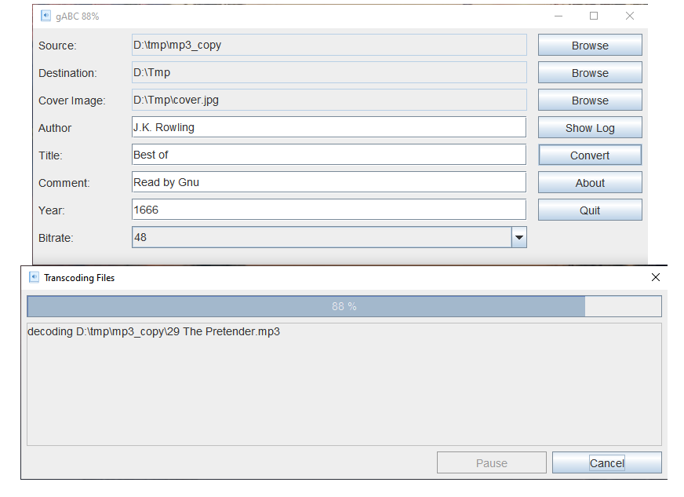

# gABC
gABC is an open source mp3 audio book converter written in [kotlin](https://kotlinlang.org). 
It is an frontend for lame encoder/decoder. 
gABC takes a directory or an CD of mp3 files as input and converts them into one single mp3 file. 
The bitrate can be changed during transcoding. 
48 kbps is usually sufficient for speech in mono. 
All mp3 files must have same samplerate and number of channels (stereo/mono). 
The result file will be in mono 
Be aware that the files will be transcoded and sound quality will be degraded somewhat. 

You will need [Java](http://java.com) installed to run this program. 
The actual transcoding of audio files are done by [lame](http://lame.sourceforge.net). 
And lame must be in application path. 
Download lame for windows at [rarewares](https://www.rarewares.org/mp3-lame-bundle.php). 

## License & Download
gABC is released under the [GNU General Public License v3.0](LICENSE). 
Downloaded from [here](https://github.com/gnuwimp/gabc/releases) 
Double click to start the program or run it from the command line with "<code>java -jar gabc.jar</code>". 

## Screenshots

