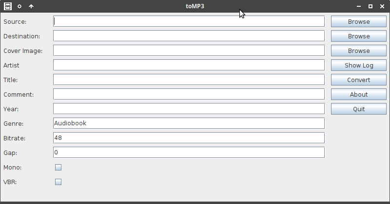
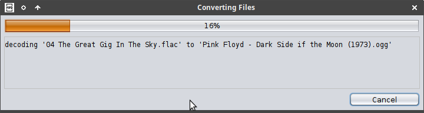

# toMP3 is an audio converter

## About
toMp3 converts an directory with audio or video files into one single mp3/ogg file.  
The first version was only for mono audio books but it can now work with various formats.  
It uses lame/oggenc/ffmpeg for all the transcoding.  
All input files must have same samplerate and number of channels (stereo/mono) and bitwidth.  
Beware that all files that are lossy encoded will be lose some audio quality when transcoded.
toMP3 is  written in [kotlin](https://kotlinlang.org) and released under the [GNU General Public License v3.0](LICENSE).  

## Download
[Java](https://java.com) is needed to run [toMP3](https://github.com/gnuwimp/toMP3/releases).  
[Lame](https://lame.sourceforge.io) is used for encoding and decoding mp3 files.  
And [oggenc](https://www.xiph.org/ogg) for encoding ogg files.  
To decode aac/flac/wav/ogg/avi/mp4/mkv files [ffmpeg](https://www.ffmpeg.org) must be installed.

## Usage
Double click toMP3.jar file on windows to start the program.  
Or run it from the command line with <code>java -jar toMP3.jar</code>.  
toMP3 has been tested on Windows 10 and Ubuntu 21.04.  

## Command Line Arguments  
It can also use arguments, (use only ascii characters on Windows).  
And use "" around text and paths with spaces.  
<pre>
--src  [PATH]              source directory with audio files
--dest [PATH]              destination directory for target file
--artist [TEXT]            artist name
--title [TEXT]             album and title name
--comment [TEXT]           comment string (optional)
--cover [PATH]             track cover image (optional)
--year [YYYY]              track year (optional, 1 - 2100)
--genre [TEXT]             genre string (optional, default Audiobook)
--gap [SECONDS]            insert silence between tracks (optional, default 0)
                             valid values are: 0 - 5
--mono                     downmix stereo to mono (optional)
--encoder                  index in encoder list (optional, default 4 -> MP3 CBR 128 Kbps)
                             0 = MP3 CBR 32 Kbps
                             1 = MP3 CBR 48 Kbps
                             2 = MP3 CBR 64 Kbps
                             3 = MP3 CBR 96 Kbps
                             4 = MP3 CBR 128 Kbps
                             5 = MP3 CBR 192 Kbps
                             6 = MP3 CBR 256 Kbps
                             7 = MP3 CBR 320 Kbps
                             8 = MP3 VBR ~160 Kbps
                             9 = MP3 VBR ~190 Kbps
                             10 = MP3 VBR ~240 Kbps
                             11 = Ogg ~45 Kbps
                             12 = Ogg ~64 Kbps
                             13 = Ogg ~96 Kbps
                             14 = Ogg ~128 Kbps
                             15 = Ogg ~192 Kbps
                             16 = Ogg ~256 Kbps
                             17 = Ogg ~320 Kbps
                             18 = Ogg ~500 Kbps
--auto                     start automatically and quit after successful encoding (optional)
--auto2                    start automatically and quit even for error (optional)
</pre>

## Screenshots

## Changes
<pre>
2.3:    added jaudiotagger for tag writing
        added support for ogg encoding
        ui changes
        bitrate selection changed

2.2:    renamed from gabc to toMP3
        added support for more input files (aac/flac/ogg/wav/avi/mkv/mp4)
        options for mono/stereo and vbr
        insert silence between tracks
        bug fixes

2.1:    bug fixes
</pre>
